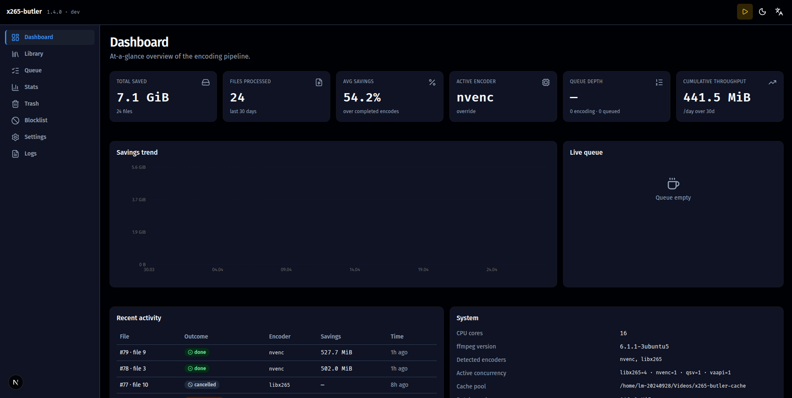
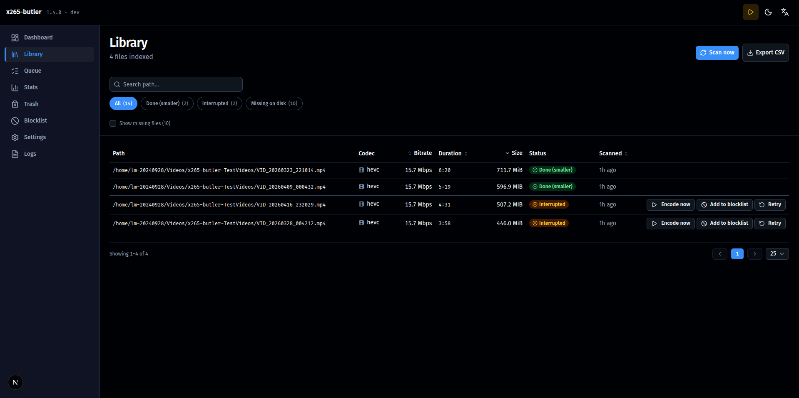
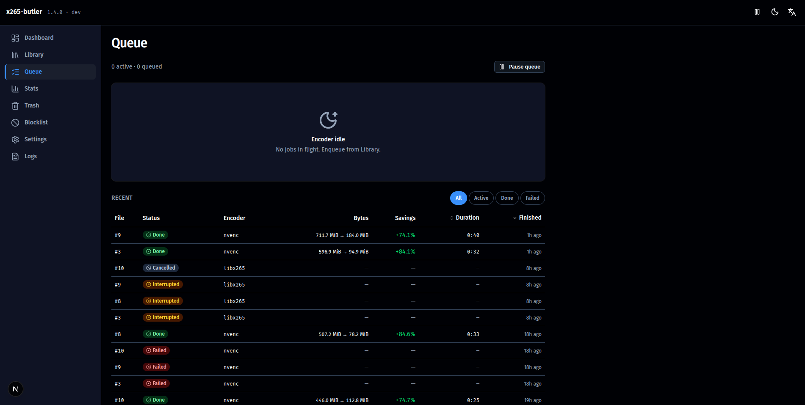
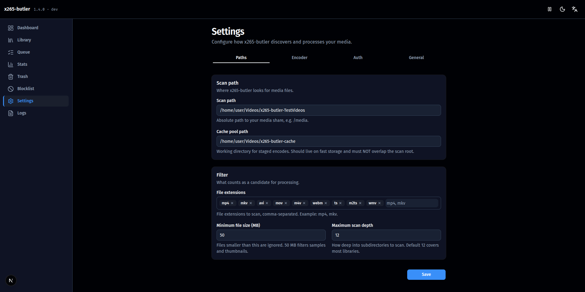
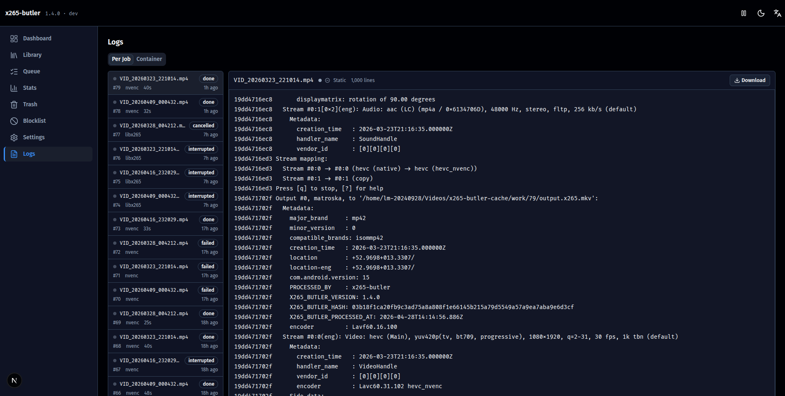
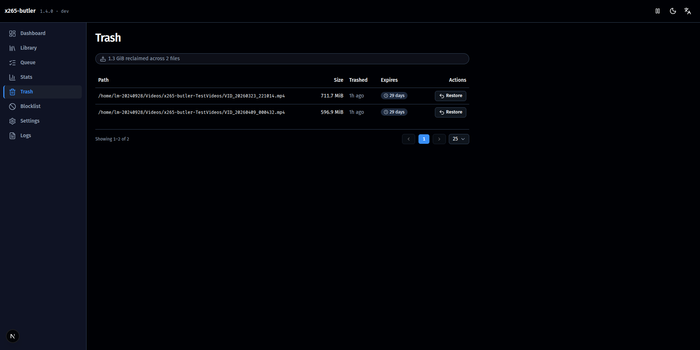
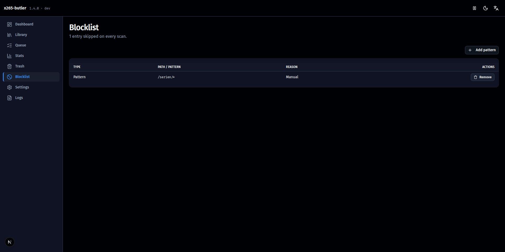

# x265-butler

> Self-hosted web application that scans media shares, transcodes video files to HEVC (x265) with hardware acceleration, and intelligently avoids re-encoding work already done.

**Type:** Application · **License:** [PolyForm Noncommercial 1.0.0](LICENSE) · Contributions: [CLA](CLA.md)

[](https://github.com/masterjb/x265-butler/tags)
[](https://github.com/masterjb/x265-butler/pkgs/container/x265-butler)
[](#deployment)
[](https://nextjs.org/)
[](https://nodejs.org/)
[](https://www.typescriptlang.org/)
[](LICENSE)
[](#security)

---

## Overview

x265-butler is a Docker-based, unRAID-native tool for recursively scanning a media share, transcoding video files to HEVC (x265) with hardware acceleration when available, and tracking every attempt so it never re-encodes files already processed.

**Built for:** Self-hosters on unRAID who want a focused, opinionated transcoder that integrates cleanly with unRAID conventions (cache-pool aware, CA template, PUID/PGID, shfs-aware path handling) without the overhead or lock-in of heavier alternatives.

**Distribution:** Published on the unRAID Community Applications store.

### Core Capabilities

- Recursive scan of a configurable share for video files (filtered by extension and minimum size)
- "Encode automatically" master switch: files are only queued without a click when it is on (new installs start with it off, the onboarding wizard asks)
- Transcoding to HEVC using auto-detected hardware encoders (QSV, NVENC, VAAPI) with libx265 software fallback
- Cache-pool staging so HDDs stay spun down during encoding
- Hash-based file identity (partial SHA-256 over three 4 MB chunks) that survives rename and move
- Multi-layer skip logic: codec check, bitrate heuristic, DB lookup, blocklist, MKV metadata tag
- Optional auto-crop / black-bar removal (cropdetect-driven, opt-in per Settings)
- Device-aware hardware encoder selection — multi-GPU hosts can target a specific Intel/AMD/NVIDIA device
- Safe originals handling via trash with configurable retention (default 30 days) and restore; new installs keep the trash in a hidden folder inside the share (a rename, no copy), and the trash can be turned off
- Selectable output strategy: keep the `.x265.mkv` suffix or replace the original in place (trash-first, hardlink-safe, crash-recoverable); sidecar metadata written beside the file, off, or to a central tree under `/config`
- Dense, dark-mode-first dashboard with live SSE progress, per-job progress bars, concurrent-job visibility, cumulative savings stats
- Optional username/password auth (off by default), EN/DE i18n via next-intl
- Self-diagnostics page with hardware-encoder probe, render-node permission evidence, CPU/event-loop attribution, and copyable bug-report

### Screenshots















### Highlights

- First-run wizard on an empty database (scan path, encoder detection, CRF default)
- Each running job keeps a stable slot in the queue view, with progress, FPS, ETA and encoder name
- Active job count in the top bar and in the browser tab title, visible from any page
- Keyboard navigation with visible focus rings; `prefers-reduced-motion` is respected
- Works from phone width (375 px) to desktop; on small screens the library table becomes cards

---

## Docker Tag Strategy

Two GHCR tags are published per release:

- **`:X.Y.Z`** — Exact-semver pin (e.g. `ghcr.io/masterjb/x265-butler:2.40.0`). Reproducible, frozen at the build that created it. Recommended for production-stability operators.
- **`:latest`** — Floating across all versions. Auto-deploys every new release on next container restart, including Major-version transitions.

> **⚠️ `:latest` auto-deploys breaking changes.** Major transitions (`v2.x → v3.x`) MAY introduce breaking changes (config format, env-var renames, DB-schema migrations). If your deployment cannot tolerate unannounced Major upgrades, **pin to an exact semver**:
> - CA template: Edit Container → set `Repository` to `ghcr.io/masterjb/x265-butler:2.40.0`
> - `docker-compose.yml`: `image: ghcr.io/masterjb/x265-butler:2.40.0`

---

## Stack

- **Next.js 15** (App Router) + **React 19** + **TypeScript 5**
- **better-sqlite3** for persistence (single-file DB under `/config`)
- **next-intl** for EN/DE localisation
- **Tailwind CSS 4** + shadcn/ui + Base UI components
- **ffmpeg** (bundled in the image) for transcoding and hardware probing
- Single-process custom Next.js server; SSE for live progress

---

## Deployment

### unRAID (Production)

Single container:

- Image: `:latest` (auto-update) or `:X.Y.Z` (exact pin) — see [Docker Tag Strategy](#docker-tag-strategy)
- Default port: `3000` (template default; map any free host port, e.g. `8765:3000`)
- Volumes:
  - `/config` → `/mnt/user/appdata/x265-butler/` (AppData: database, settings, cache, see [Storage layout](#storage-layout-appdata))
  - `/media` → `/mnt/user/{SHARE}/` (read/write: Butler writes the HEVC file into the same folder as the original)
  - optional `/cache` → `/mnt/cache/x265-butler/` (Cache Pool: scratch on a fast pool)
- Devices: `/dev/dri:/dev/dri` (QSV/VAAPI); see [NVIDIA NVENC](#nvidia-nvenc) for NVENC
- Env: see [Environment variables](#environment-variables)
- Container starts as root, downgrades to `PUID:PGID` via `gosu` before running Node

### Environment variables

All variables are optional. The table lists what the container reads; anything not listed here is not an operator setting.

| Variable | Default | Read by | Purpose |
|----------|---------|---------|---------|
| `PUID` | `99` | entrypoint | User ID the app runs as after the entrypoint drops root (typically `99` on unRAID). |
| `PGID` | `100` | entrypoint | Group ID the app runs as (typically `100` on unRAID). |
| `TZ` | `UTC` | OS | Container timezone for log timestamps. The CA template sets `Europe/Berlin`. |
| `LOG_LEVEL` | `info` | app | Container log level, e.g. `debug`, `info`, `warn`, `error` or `silent`. Unknown values fall back to `info` with a warning. |
| `NVIDIA_VISIBLE_DEVICES` | unset | driver | GPUs the NVIDIA runtime passes in, usually `all`. Needed for NVENC together with `--runtime=nvidia`. |
| `NVIDIA_DRIVER_CAPABILITIES` | unset | driver | Must include `video` (use `compute,video,utility`), otherwise NVENC fails. |
| `LIBVA_DRIVER_NAME` | set by entrypoint | driver | VAAPI driver. On Intel the entrypoint sets `iHD` and falls back to i965 if it does not load; leave unset. |
| `DB_PATH` | `/config/x265-butler.db` | app | Location of the SQLite database. Only change it for special setups. |
| `FFMPEG_PATH` | `ffmpeg` | app | ffmpeg binary for encodes, probes and benchmarks. Only for custom builds. |
| `FFMPEG_NVENC_PATH` | `ffmpeg-nvenc` | app | ffmpeg binary used for NVENC encodes (bundled build that supports older NVIDIA drivers). |
| `FFPROBE_PATH` | `ffprobe` | app | ffprobe binary for media analysis. |
| `SCRATCH_DIR` | `/app/.data/bench-scratch` | app | Scratch folder for benchmark runs only. Encode scratch space is the cache path (see [Storage layout](#storage-layout-appdata)). |
| `ALLOWED_ORIGINS` | unset | app | Comma-separated extra origins accepted by the diagnostics endpoint that collects browser log events. Requests from the page's own host are always accepted. This is not a CORS or login setting and does not protect any other route. |
| `INTERNAL_API_URL` | `http://localhost:3000` | app | Base URL the server uses to call its own API when rendering the Trash page. Change it only if the container port differs from `3000`. |
| `CHOKIDAR_USEPOLLING` | unset | app | `1` forces file polling for every watched share and overrides the automatic choice. For troubleshooting only. |

### Storage layout (AppData)

One path is enough: **AppData** (container path `/config`), by default `/mnt/user/appdata/x265-butler/`. It holds the database, the settings and a `cache/` subfolder for encode scratch space and job logs.

**Cache Pool (optional)**, container path `/cache`: map it to move the scratch space onto a fast pool, e.g. `/mnt/cache/x265-butler/`. Leave it empty to keep the cache inside AppData. A path set under Settings, Cache path, still takes precedence.

**Media**, container path `/media`: your library share, read/write. There is no separate output path; the encoded file goes into the folder of its source. Installations from an older template that map the share as `/library` keep working unchanged: the scan path stored in Butler stays `/library`.

Existing installations need no change: the AppData path is the same `/config` mapping as before. If you already mapped `/cache`, Butler uses it from this version on (before, it was ignored and the cache stayed in `/config/cache`); job logs of older jobs then no longer show in the UI.

### Community Applications Install

Recommended path for unRAID operators — install via the CA store rather than hand-crafting a container.

1. Open the unRAID web UI → **Apps** tab (Community Applications plugin required).
2. Search for `x265-butler` → **Install**.
3. Fill in the volume mappings:
   - AppData (`/config`) → `/mnt/user/appdata/x265-butler/` (unRAID fills in your appdata share)
   - Media (`/media`) → your media share, e.g. `/mnt/user/Movies/`. Read/write: the new file lands next to the original (suffix `-x265`, or replacing it if you pick that under Settings).
   - Cache Pool (optional, `/cache`): leave empty to keep the cache inside AppData
4. (Optional) Add device pass-through (see [Hardware Acceleration](#hardware-acceleration)).
5. Set `PUID` / `PGID` to match your share permissions (typically `99` / `100` on unRAID).
6. **Apply**.

### docker-compose

```yaml
services:
  x265-butler:
    image: ghcr.io/masterjb/x265-butler:latest
    container_name: x265-butler
    ports:
      - "8765:3000"
    environment:
      PUID: "99"
      PGID: "100"
      TZ: "Europe/Berlin"
    volumes:
      - /mnt/user/appdata/x265-butler:/config
      - /mnt/user/Movies:/media
      # optional Cache Pool: scratch space on a fast pool instead of /config/cache
      # - /mnt/cache/x265-butler:/cache
    devices:
      - /dev/dri:/dev/dri        # QSV / VAAPI
    restart: unless-stopped
```

### Local Development

`npm install && npm run dev` runs Next.js (custom server, single process) on port 3000. The SQLite database lives at `./data/dev.db`. A seed script generates fake library entries for UI work without requiring ffmpeg.

---

## Hardware Acceleration

Drivers ship with the image — no `apt install` needed inside the container. The entrypoint auto-detects the right VAAPI driver per PCI-vendor scan + iHD load-probe, with `i965` fallback for pre-gen8 Intel iGPUs.

### Intel QuickSync / VAAPI

Pass through the render node:

```
--device /dev/dri:/dev/dri
```

HEVC-QSV requires Skylake (gen 6)+; 10-bit requires Kaby Lake (gen 7)+. On older silicon the onboarding wizard recommends the libx265 software fallback. The image bundles the oneVPL GPU-runtime (`libmfx-gen1.2`, `libvpl2`, `libigfxcmrt7`) required by modern Intel QSV.

Verify: `docker exec x265-butler vainfo --display drm` should list `VAEntrypointEnc*` lines.

### NVIDIA NVENC

NVENC needs the host driver (unRAID NVIDIA-Driver-Plugin or nvidia-container-toolkit) plus these container settings:

**Extra Parameters:**
```
--runtime=nvidia
```

**Variables:**
```
NVIDIA_VISIBLE_DEVICES=all
NVIDIA_DRIVER_CAPABILITIES=compute,video,utility
```

> The **`video`** capability is the one that bites you: the runtime default is `compute,utility` and **without `video` the NVENC session fails to init** even though `nvidia-smi` works fine. `utility` = the detection probe, `compute` = CUDA filters, `video` = NVENC itself.

Verify: `docker exec x265-butler nvidia-smi -L` → expect a `GPU 0: ...` line.

### AMD VAAPI (Mesa)

Pass through `/dev/dri:/dev/dri`; the Mesa VAAPI driver in the image handles AMD GPUs (RDNA, Vega, Polaris). Leave `LIBVA_DRIVER_NAME` unset, Mesa detects the GPU itself.

Verify: `docker exec x265-butler vainfo --display drm` should show the Mesa Gallium driver and `VAEntrypointEncSlice`.

---

## Security

- **No telemetry.** The application makes no outbound calls.
- Optional username/password auth, enabled under Settings, off by default. Intended for trusted LAN deployments; put a reverse proxy in front if exposed.
- Internal API consumed only by the built-in UI. No public endpoints, no third-party integrations.
- Container runs as `PUID:PGID` (not root) after entrypoint privilege-drop via `gosu`.

See [SECURITY.md](SECURITY.md) for the vulnerability-disclosure policy.

---

## License

x265-butler is licensed under the **[PolyForm Noncommercial License 1.0.0](LICENSE)** (SPDX: `PolyForm-Noncommercial-1.0.0`).

- Allowed: personal use (self-hosters, hobbyists, home media servers), non-profit, educational and research use; modify, fork and redistribute under the same license; contribute (see [CLA.md](CLA.md)).
- Not allowed: commercial use by third parties (selling, paid services, monetized hosting); sublicensing or removing the license notice.

For commercial use, ask the project owner for a separate license.

### Third-party components

The container image bundles GPL-3.0+ FFmpeg and a Debian `non-free-firmware` VAAPI driver. See [LICENSES.md](LICENSES.md) for the full breakdown.

### Contributing

Contributions are accepted under the [Individual Contributor License Agreement](CLA.md), signalled by a `Signed-off-by:` line on each commit (`git commit -s`). See [CONTRIBUTING.md](CONTRIBUTING.md).
